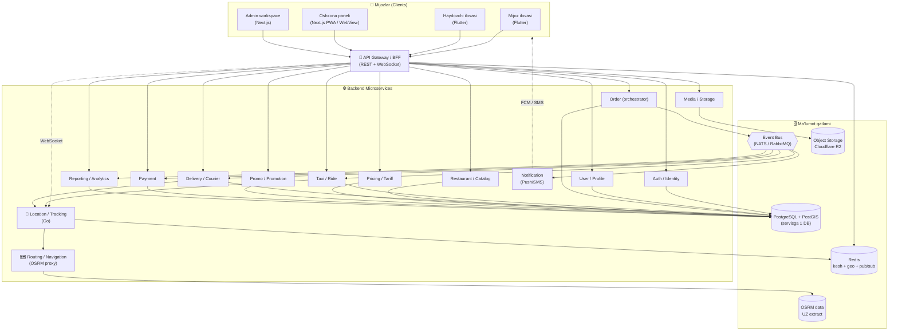
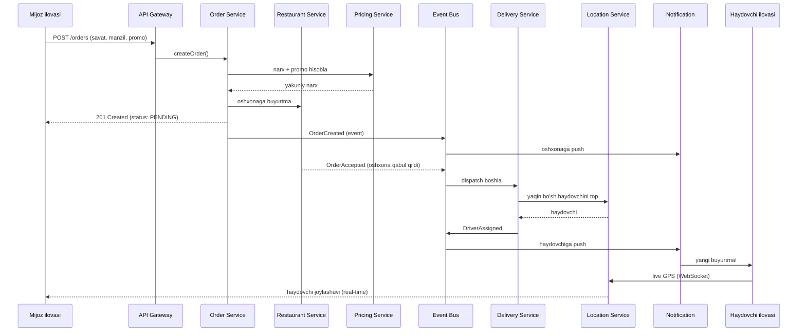

# 01 — Tizim arxitekturasi

> Asosiy fayl: [README.md](README.md) · Bog'liq: [04-backend-services.md](04-backend-services.md), [03-databases.md](03-databases.md)

## 1. Umumiy yondashuv

Tizim **microservice arxitekturasi** asosida quriladi, lekin **pragmatik** yo'l bilan:

> **Tavsiya:** boshida "modular monolith → microservices" yo'lidan boramiz.
> Ya'ni kodni allaqachon servislarga bo'lamiz (alohida modul, alohida DB sxemasi, aniq chegara), lekin dastlab kamroq konteynerda deploy qilamiz. Yuk oshganda har modulni alohida servisga ajratish oson bo'ladi.

**Sabab:** to'liq Kubernetes + 15 ta servis bitta tuman uchun boshida ortiqcha xarajat va murakkablik. Lekin chegaralar to'g'ri qo'yilsa, kelajakda ajratish og'riqsiz bo'ladi. Batafsil: [16-risks-decisions.md](16-risks-decisions.md) (ADR-001).

## 2. Yuqori darajadagi diagramma

## 3. Asosiy tamoyillar

1. **Database per service** — har servisning o'z DB'si/sxemasi. Boshqa servis DB'siga to'g'ridan-to'g'ri tegmaydi (faqat API yoki event orqali).
2. **Async-first** — og'ir va kechikishi mumkin bo'lgan ishlar (notify, report, payment) **event bus** orqali asinxron.
3. **API Gateway / BFF** — barcha clientlar bitta darvozadan kiradi: autentifikatsiya, rate-limit, marshrutlash, til (locale) header.
4. **Stateless servislar** — sessiya holati Redis/JWT'da, servislarni gorizontal masshtablash oson.
5. **Real-time alohida yo'l** — joylashuv (GPS) va kuzatuv WebSocket orqali, alohida tezkor **Go** servisida (yuqori chastota).
6. **Idempotency** — buyurtma yaratish, to'lov kabi operatsiyalar `Idempotency-Key` bilan (takrorlanmasligi uchun).
7. **Observability** — har servisda strukturali log, metrika, trace (boshida oddiy, keyin Grafana).

## 4. Buyurtma oqimi (event-driven misol — ovqat)

## 5. Servislar va mas'uliyat chegarasi (qisqa)

| Servis | Mas'uliyat | Til | DB |
|--------|------------|-----|-----|
| **API Gateway** | Kirish, auth check, routing, rate-limit | NestJS | — (Redis) |
| **Auth** | OTP, JWT, rol, ruxsat | NestJS | PG (auth) |
| **User** | Profil, manzillar, sevimlilar | NestJS | PG (user) |
| **Order** | Buyurtma hayot sikli, orkestratsiya | NestJS | PG (order) |
| **Taxi** | Safar mantiqi, holatlar | NestJS | PG (taxi) |
| **Delivery** | Dostavka/kuryer mantiqi, dispatch | NestJS | PG (delivery) |
| **Restaurant** | Menyu, kategoriya, narx, ish vaqti | NestJS | PG (restaurant) |
| **Pricing** | Tarif, minimal narx, km/daqiqa, ulush | NestJS | PG (pricing) |
| **Promo** | Promokod, aksiya, chegirma | NestJS | PG (promo) |
| **Payment** | Payme/Click/Uzum, naqd, hisob-kitob | NestJS | PG (payment) |
| **Location** | Real-time GPS, geo-qidiruv, kuzatuv | **Go** | Redis (geo) |
| **Routing** | Marshrut, ETA, masofa (OSRM) | Go/NestJS | OSRM data |
| **Notification** | Push (FCM), SMS, in-app | NestJS | PG (notif) |
| **Reporting** | Hisobot, analitika, agregatsiya | NestJS | PG (read replica) |
| **Media** | Rasm/fayl yuklash, optimizatsiya | NestJS | R2 |

> Har birining batafsil API va eventlari: [04-backend-services.md](04-backend-services.md).

## 6. Ma'lumot bazasi ajratish strategiyasi

Foydalanuvchi alohida "tezkor" bazalar so'ragan. Quyidagicha amalga oshiramiz:

- **Taksi DB** — `taxi` xizmati ma'lumotlari (safar, holat, narx loglari). PostgreSQL.
- **Oshxona DB** — menyu, kategoriya, taom, oshxona profili. PostgreSQL (yoki katalog uchun keshlanadi).
- **Navigator DB** — geo ma'lumot: PostGIS (POI, geometriya) + OSRM (marshrut grafi) + Redis Geo (real-time joylashuv).
- Qolgan servislar ham o'z DB/sxemasiga ega.

Bitta fizik PostgreSQL serverida **bir nechta logik database** (yoki sxema) bilan boshlaymiz, keyin yuk oshganda fizik ajratamiz. Batafsil: [03-databases.md](03-databases.md).

## 7. Real-time qatlam (tracking)

- Haydovchi ilovasi har **3–5 soniyada** GPS yuboradi → **Location (Go)** servisi → Redis Geo (`GEOADD`).
- Mijoz/Admin WebSocket orqali ulanib, faqat o'ziga tegishli buyurtma haydovchisini kuzatadi.
- Dispatch: `GEOSEARCH` bilan radius ichidagi bo'sh haydovchilarni topish (O(log n)).
- Batafsil: [09-maps-navigation.md](09-maps-navigation.md), [14-api-design.md](14-api-design.md).

## 8. Texnologik to'plam (xulosa)

Diagrammadagi tanlovlar uchun to'liq asoslar va alternativalar → [02-tech-stack.md](02-tech-stack.md).

## 9. Bog'liq fayllar
- Texnologiyalar → [02-tech-stack.md](02-tech-stack.md)
- Backend servislari → [04-backend-services.md](04-backend-services.md)
- Ma'lumot bazalari → [03-databases.md](03-databases.md)
- API dizayni → [14-api-design.md](14-api-design.md)
- Infratuzilma → [12-infrastructure-devops.md](12-infrastructure-devops.md)
