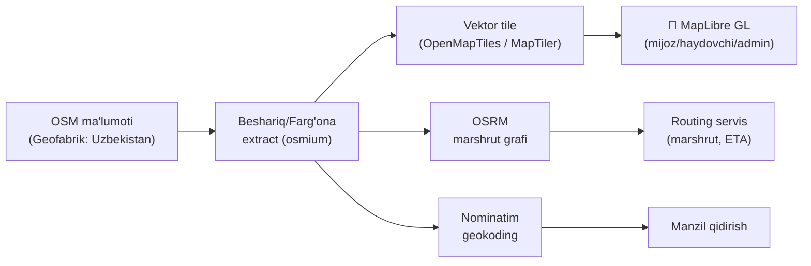

# 09 — Xarita va Navigatsiya

> Asosiy fayl: [README.md](README.md) · Maqsad: **to'liq bepul** xarita + marshrut, faqat Farg'ona viloyati / Beshariq tumani uchun yetarli.

## 1. Strategiya: OpenStreetMap ekotizimi (hammasi bepul)

Google Maps / Yandex API pullik va limitlangan. Biz **OpenStreetMap (OSM)** asosida o'z stack'imizni quramiz — bepul, cheksiz, offline mumkin, faqat kerakli hududni yuklaymiz.

## 2. Komponentlar

| Vazifa | Yechim | Izoh |
|--------|--------|------|
| Xarita ma'lumoti | **OSM** — Geofabrik "Uzbekistan" extract | Bepul `.osm.pbf` |
| Hududni kichraytirish | **osmium-tool** — Farg'ona/Beshariq bbox | Faqat kerakli hudud |
| Xarita ko'rsatish | **MapLibre GL** (mobil + web) | Mapbox'ning bepul ochiq forki |
| Tile (plitka) | **MapTiler free** (start) → o'z **OpenMapTiles** serveri | Limit oshganda o'zimizniki |
| Marshrut (routing) | **OSRM** (o'z serverimizda) | Bepul, tezkor, UZ grafi |
| Geokoding | **Nominatim** (o'z serverimizda) | Manzil ↔ koordinata |
| Real-time joylashuv | **Redis Geo** | Haydovchi GEO set |
| Hudud geometriyasi | **PostGIS** | Zona/mahalla poligonlari |

## 3. MapLibre — nega?
- To'liq bepul, ochiq kod (Mapbox GL'ning litsenziyasiz forki).
- Flutter (`maplibre_gl`) va web (`maplibre-gl-js`) — bir xil uslub.
- **Vektor tile + offline** → Beshariq xaritasini telefonga keshlash mumkin (kam internetda ishlaydi).
- Marker, polyline (marshrut), kamera animatsiyasi — hammasi bor.

## 4. OSRM — marshrut va ETA
- Geofabrik'dan `uzbekistan-latest.osm.pbf` → `osrm-extract` → `osrm-partition` → `osrm-customize` → `osrm-routed`.
- Profil: `car` (taksi/kuryer mashina uchun). Kerak bo'lsa `bicycle`/`foot` (piyoda kuryer).
- API:
  - `GET /route/v1/driving/{lon,lat};{lon,lat}` → masofa, vaqt, polyline.
  - `GET /table/v1/driving/...` (matrix) → dispatch'da bir nechta haydovchidan eng yaqinini tanlash.
- Bizning **Routing servisi** OSRM ustida yengil qobiq: kesh, til, narx uchun masofa/vaqt qaytaradi.
- Hammasi bitta arzon serverda (Oracle Free ARM) ishlaydi — faqat O'zbekiston grafi kichik.

## 5. Geokoding — Nominatim
- Manzilni qidirish ("Beshariq markaz", ko'cha nomi) → koordinata.
- Reverse: koordinata → manzil matni (buyurtma manzili uchun).
- O'z serverimizda (UZ ma'lumoti bilan) yoki MVP'da bepul public Nominatim (limit bilan).

## 6. Real-time tracking (jonli kuzatuv)
- Haydovchi GPS → **Location servisi (Go)** → Redis Geo (`GEOADD driver_locations`).
- Mijoz WebSocket'ga ulanadi (`/ws/track/:order`) → haydovchi nuqtasi 3–5 s'da yangilanadi.
- Dispatch: `GEOSEARCH ... BYRADIUS 3 km` → eng yaqin bo'sh haydovchilar.
- Yo'l izi (track) → `trip_points` (keyin tahlil/nizolar uchun).
> Servis tafsiloti → [04-backend-services.md](04-backend-services.md) (Location, Routing).

## 7. Beshariq uchun maxsus ishlar
- **Xizmat zonasi (geofence):** Beshariq tumani chegarasi poligoni → undan tashqari buyurtma cheklanadi/ogohlantiriladi.
- **Tarif zonalari:** mahallalar bo'yicha poligon (zona narxi uchun) → PostGIS.
- **Offline xarita:** Beshariq tile to'plamini ilovaga oldindan yuklash (kam internetli joylar uchun).
- **POI:** mahalliy muhim joylar (bozor, kasalxona, maktab) — manzil tanlashda yordam.
- **Aniqlik:** OSM'da Beshariq ko'chalari to'liq bo'lmasligi mumkin → biz **OSM'ga o'zimiz qo'shamiz/tuzatamiz** (bepul, jamoa orqali) yoki o'z qatlamimizni yuritamiz.

## 8. Navigatsiya (haydovchi uchun)
- **MVP:** marshrut chizig'i + masofa + ETA + "keyingi burilish" matni.
- **Keyingi faza:** turn-by-turn ovozli navigatsiya (`flutter_maplibre` + OSRM steps yoki tashqi navigatsiyaga uzatish).
- Variant: ilova ichidan tashqi navigatorga (Yandex Navi/Google) "ochish" tugmasi — agar o'z navigatsiyamiz yetarli bo'lmasa.

## 9. Xarajat va limit
- MVP: MapTiler bepul tile + public Nominatim + o'z OSRM (Oracle Free) → **deyarli 0 so'm**.
- O'sganda: o'z tile serveri (OpenMapTiles) → tiledan ham mustaqil, cheksiz.

## 10. Bog'liq fayllar
- Location/Routing servislari → [04-backend-services.md](04-backend-services.md)
- Geo ma'lumot (PostGIS/Redis) → [03-databases.md](03-databases.md)
- Haydovchi navigatsiya → [06-driver-app.md](06-driver-app.md)
- Infra (OSRM hosting) → [12-infrastructure-devops.md](12-infrastructure-devops.md)
