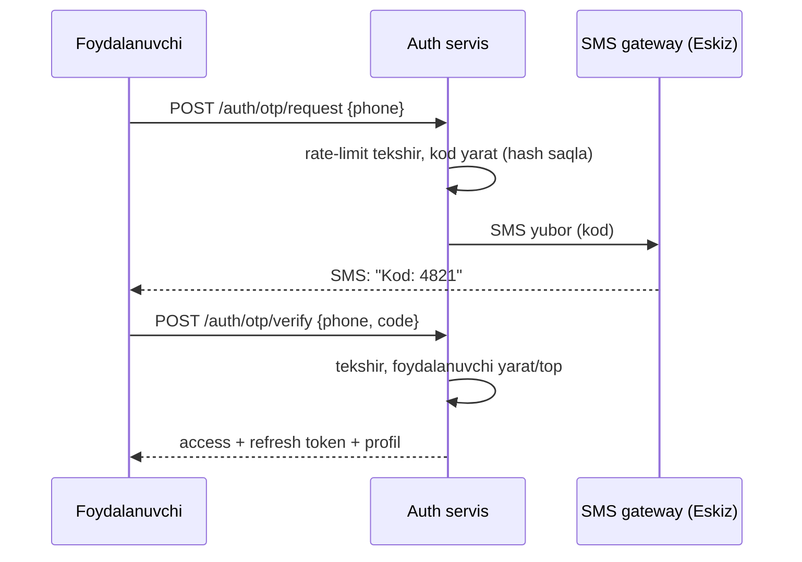

# 10 — Autentifikatsiya, Ro'yxatdan o'tish, Maxfiylik va Xavfsizlik

> Asosiy fayl: [README.md](README.md) · Bog'liq: [04-backend-services.md](04-backend-services.md) (Auth servisi)

## 1. Ro'yxatdan o'tish va kirish (Registration / Login)

### Usul: telefon raqami + OTP (O'zbekiston standarti)

- **OTP:** 4–6 raqam, 60–120 s amal qiladi, 3–5 urinish limiti.
- **Rate-limit:** bitta raqamga daqiqada 1 SMS, kuniga limit (spam/pulni himoya).
- **Yangi foydalanuvchi** → profil to'ldirish (ism, til). Mavjud bo'lsa → to'g'ridan kirish.
- **Rollar:** bitta raqam bir nechta rolga ega bo'lishi mumkin (mijoz + haydovchi), lekin har ilova o'z rolini so'raydi.

### Token strategiyasi (JWT)
- **Access token** — qisqa muddat (15–30 daqiqa), API'ga yuboriladi.
- **Refresh token** — uzoq muddat (30 kun), Redis'da, almashtirilganda eskisi bekor (rotation).
- Mobil: token `flutter_secure_storage`'da (shifrlangan).
- Logout → refresh token bekor qilish.

### SMS gateway
- **Eskiz.uz** yoki **Play Mobile** — O'zbekiston operatorlari uchun.
- Trial/test: dev rejimda kod logga chiqadi (SMS yubormasdan).

## 2. Maxfiylik va rozilik (siz alohida so'ragan)

### Ro'yxatdan o'tishda rozilik
- Ro'yxat oxirida **"Foydalanish shartlari"** va **"Maxfiylik siyosati"** ga rozilik (checkbox, majburiy).
- Rozilik **versiyasi va sanasi** saqlanadi (`auth_db.consents`). Siyosat o'zgarsa — qayta so'raladi.
- Alohida roziliklar (granular):
  - 📍 Joylashuvdan foydalanish (xizmat uchun zarur).
  - 🔔 Push/marketing xabarlar (ixtiyoriy — alohida).
  - 📊 Tahlil/yaxshilash uchun ma'lumot (ixtiyoriy).

### Hujjatlar (ilova ichida)
- Foydalanish shartlari, Maxfiylik siyosati — 3 tilda, ilova ichida ko'rsatiladi.
- Ularni `docs/legal/` da saqlaymiz va versiyalaymiz.

### Shaxsiy ma'lumotlarni himoya qilish (O'zbekiston qonuni)
- "Shaxsga doir ma'lumotlar to'g'risida"gi qonun talablariga rioya.
- Minimal ma'lumot to'plash (faqat xizmat uchun zarur).
- Foydalanuvchi: ma'lumotini ko'rish/o'chirish so'rovi (account o'chirish).
- Ma'lumot O'zbekiston/ishonchli hududda saqlanishi (hosting tanlashda hisobga olish).

## 3. RBAC — Rolga asoslangan ruxsatlar

| Rol | Asosiy huquqlar |
|-----|-----------------|
| `customer` | Buyurtma berish, kuzatish, profil |
| `driver` | Buyurtma qabul, navigatsiya, daromad |
| `restaurant` | O'z menyu/buyurtmalari |
| `operator` | Buyurtmalarni ko'rish, qo'lda biriktirish |
| `admin` | Hamkor/haydovchi/buyurtma boshqaruvi |
| `super_admin` | Hammasi: pul, foiz, sozlama |

- Har endpoint rol/ruxsat bilan himoyalanadi (Gateway + servis darajasida).
- Oshxona faqat **o'z** ma'lumotini ko'radi (resource ownership tekshiruvi).

## 4. Xavfsizlik (umumiy)

| Soha | Chora |
|------|-------|
| Transport | Hamma joyda **HTTPS/TLS**, WSS (WebSocket) |
| Parol/sir | `.env` + secret manager, kodga yozilmaydi |
| OTP/login | Rate-limit, brute-force himoya, hash saqlash |
| API | JWT, input validatsiya (class-validator), CORS |
| To'lov | Webhook imzo tekshirish, idempotency, narx server tomonda |
| Injeksiya | ORM (Prisma) parametrlangan so'rov, sanitatsiya |
| Fayl yuklash | Tur/hajm tekshiruv, R2 presigned URL, antivirus (kerak bo'lsa) |
| Haydovchi | Faqat tasdiqlangan (verifikatsiya) ishlaydi |
| Audit | Muhim amallar (pul, rol, bekor) loglanadi |
| DDoS/abuse | Gateway rate-limit, Cloudflare oldida |
| Sirlarni aylantirish | JWT secret, kalitlarni davriy yangilash |

## 5. Narx va biznes mantiq xavfsizligi (muhim)
- **Narx har doim server tomonda hisoblanadi** — client yuborgan narxga ishonilmaydi.
- Promokod, chegirma, komissiya — faqat backend tasdiqlaydi.
- Buyurtma yaratish **idempotent** (ikki marta bosilsa, bitta buyurtma).

## 6. Hisob xavfsizligi (haydovchi/oshxona uchun)
- Hujjat tekshiruvi (KYC yengil) — prava, mashina, oshxona litsenziyasi.
- Shubhali faollik → bloklash, qayta tekshirish.

## 7. Bog'liq fayllar
- Auth servisi API → [04-backend-services.md](04-backend-services.md)
- Til (hujjatlar 3 tilda) → [13-localization.md](13-localization.md)
- Admin RBAC → [08-admin-workspace.md](08-admin-workspace.md)
- Xavf-xatar registri → [16-risks-decisions.md](16-risks-decisions.md)
